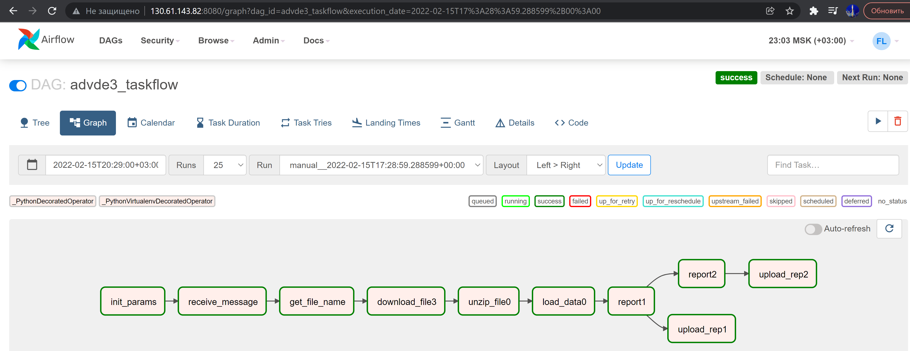
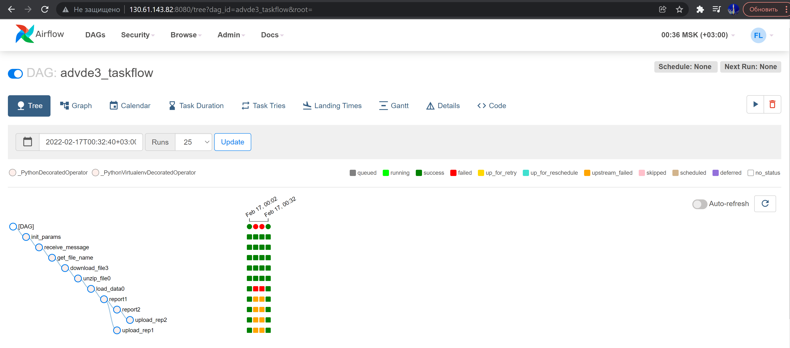

##Описание решения
Дипломная работа выполнена в DAG файле `advde3_dag.py`

###Графическое представление пайплайна (Граф)

### DAG's tasks
- `init_params()` - инициализация
- `receive_message(params)` - опрос SQS
- `get_file_name(message=message)` - парсинг сообщения
- `download_file3(file_data["file"])` - загрузка файла из бакета
- `unzip_file0(downloaded)` - распаковка архива
- `load_data0(unzipped)` - загрузка данных в Clickhouse
- `report1(final_msg)` - отчет (1) "Количество поездок в день"
- `upload_rep1(rep_data1)` - выгрузка отчета 1 в специальный бакет
- `report2(rep_data1)` - отчет (2) "Средняя продолжительность поездок в день"
- `upload_rep2(rep_data2)` - выгрузка отчета 2 в специальный бакет

### Представление пайплайна в режиме "Tree"

###Отчет по полю "gender"
К сожалению, отчет "Распределение поездок пользователей, разбитых по категории «gender»"
не сделал, из-за отстутствия поля gender (или похожего) в датасетах

